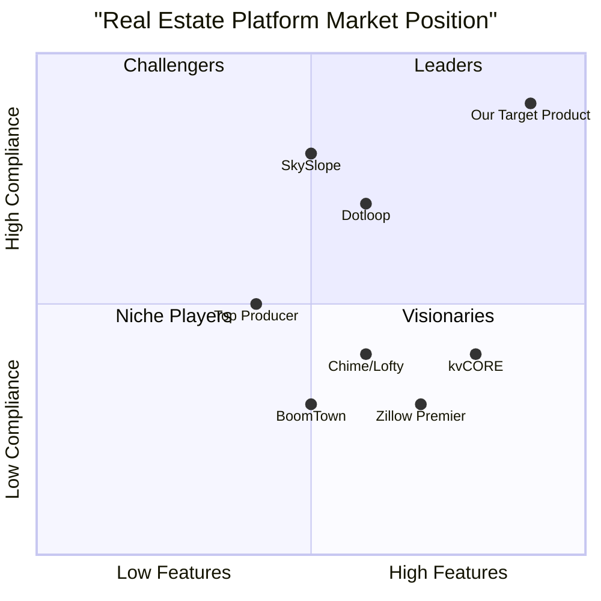
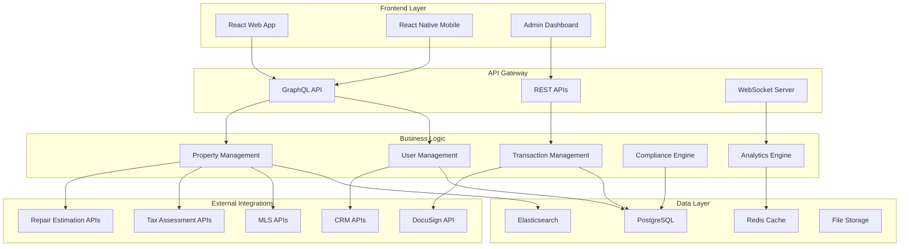
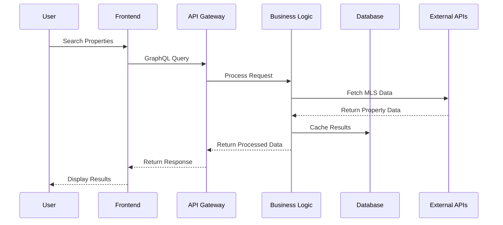
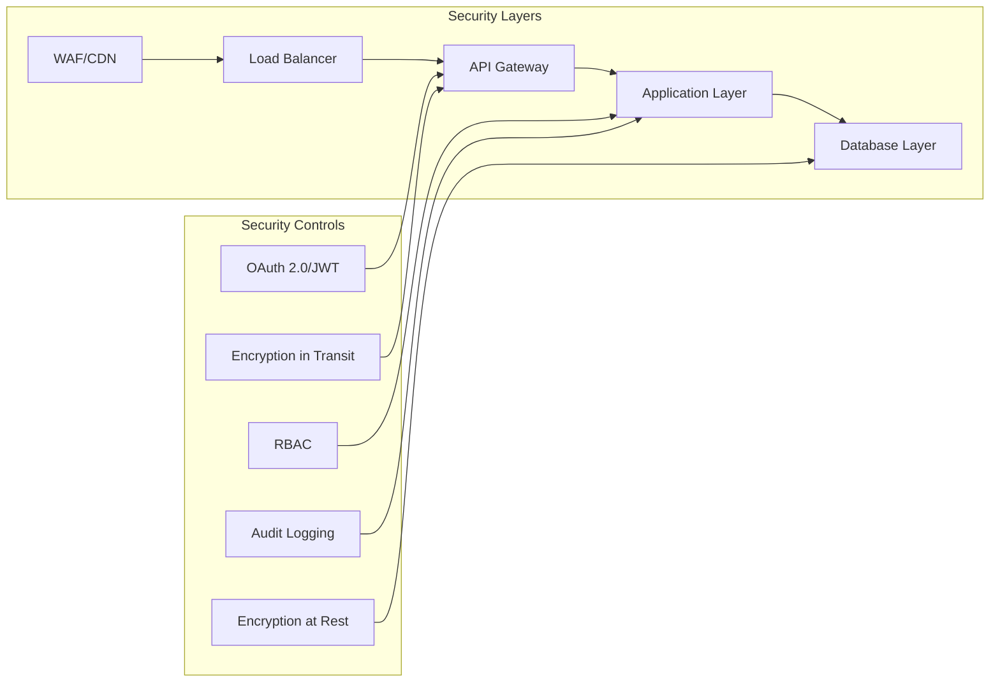

# Product Requirements Document (PRD)
# All-in-One Real Estate Platform for Florida Brokers

**Document Version:** 1.0  
**Date:** September 26, 2025  
**Language:** English  
**Programming Language:** TypeScript, React.js, Next.js, Tailwind CSS  
**Project Name:** florida_real_estate_platform  

## Original Requirements Restatement

Build an all-in-one real estate website for brokers to use in Florida, providing comprehensive transaction management, legal compliance, MLS integration, CRM functionality, and educational support specifically tailored to Florida's real estate regulations and market requirements.

---

## 1. Product Definition

### 1.1 Product Goals

**Goal 1: Legal Compliance Excellence**  
Create a platform that ensures 100% compliance with Florida real estate regulations, including FREC requirements, standardized forms, and statutory disclosures, reducing legal risk for brokers and agents.

**Goal 2: Operational Efficiency Optimization**  
Streamline real estate workflows by integrating MLS data, CRM systems, contract generation, and transaction management into a single platform, reducing manual work by 70% and transaction processing time by 50%.

**Goal 3: Market Intelligence Empowerment**  
Provide comprehensive market analytics, property valuation tools, and foreclosure management capabilities to enable data-driven decision making and identify investment opportunities in the Florida market.

### 1.2 User Stories

**US1: Broker Compliance Management**  
As a Florida real estate broker, I want to automatically generate compliant contracts using FloridaRealtors-FloridaBar standardized forms so that I can ensure legal compliance while reducing document preparation time from hours to minutes.

**US2: Agent Transaction Workflow**  
As a real estate agent, I want to manage my entire transaction pipeline from lead capture to closing in one platform so that I can focus on client relationships instead of juggling multiple software tools.

**US3: Investor Property Analysis**  
As a property investor, I want to analyze foreclosure opportunities with automated repair cost estimates and market comparables so that I can make informed investment decisions quickly.

**US4: First-Time Seller Guidance**  
As a first-time property seller, I want step-by-step guidance through the selling process with educational content and automated document management so that I understand each step and feel confident in my decisions.

**US5: Wholesaler Deal Management**  
As a real estate wholesaler, I want to manage off-market listings and generate contracts rapidly so that I can close deals faster and manage my investor network efficiently.

### 1.3 Competitive Analysis

**1. Zillow Premier Agent**
- *Pros:* Strong brand recognition, comprehensive MLS integration, automated valuation models, consumer-focused user experience
- *Cons:* Limited professional workflow tools, generic national templates, lacks Florida-specific compliance features, focuses on lead generation rather than transaction management

**2. kvCORE (BoldTrail)**
- *Pros:* AI-powered lead nurturing, comprehensive broker management tools, workflow automation, good analytics
- *Cons:* Steep learning curve, poor customer service, high pricing ($499/month), can send unwanted automated responses

**3. Chime (Lofty)**
- *Pros:* All-in-one solution, flexible website builder, team management tools, automated lead nurturing
- *Cons:* Poor customer service reputation, service quality decline after rebranding, limited IDX responsiveness

**4. BoomTown**
- *Pros:* Strong paid lead generation, high-volume lead conversion capabilities, industry reputation
- *Cons:* Expensive ($1,000+/month), slow page loading, primarily focused on paid leads only

**5. Dotloop**
- *Pros:* Strong transaction management, document collaboration, integration capabilities
- *Cons:* Limited CRM functionality, lacks market analytics, no foreclosure workflow management

**6. SkySlope**
- *Pros:* Comprehensive transaction management, compliance tracking, broker oversight tools
- *Cons:* High cost ($340/month), limited marketing automation, no MLS integration

**7. Top Producer**
- *Pros:* Real estate-focused CRM, pipeline automation, established market presence
- *Cons:* Medium integration capabilities, limited modern features, outdated user interface

### 1.4 Competitive Quadrant Chart

---

## 2. Market Research and Analysis

### 2.1 Market Size and Opportunity

The US real estate brokerage market was valued at **$206.45 billion in 2024**, with projected growth to $252.51 billion by 2030 (CAGR of 4.11%). Florida represents approximately 8-10% of the national market, indicating a **$16-20 billion addressable market** in the state.

**Key Market Characteristics:**
- Residential real estate: 81% of market share
- Sales services: 64% of market share
- Medium market concentration with consolidation accelerating
- Digital transformation driving new client acquisition models

### 2.2 Market Trends and Drivers

**Technology Adoption:**
- 92% of buyers use MLS-fed sites as primary property search source
- Real-time data synchronization now expected standard
- AI integration for predictive analytics and automation growing rapidly
- Mobile-first user experience increasingly critical

**Regulatory Environment:**
- DOJ scrutiny of buyer-agent commissions reshaping compensation structures
- Increased focus on compliance and transparency
- State-specific regulations requiring specialized solutions

**User Expectations:**
- Instant updates and real-time data access
- Integrated workflows reducing tool switching
- Educational support for first-time users
- Comprehensive mobile functionality

### 2.3 Target Market Segmentation

**Primary Market: Florida Real Estate Professionals**
- 200,000+ licensed real estate professionals in Florida
- 15,000+ active brokerages
- Average technology spend: $300-500 per agent per month
- Pain points: Compliance complexity, tool fragmentation, manual processes

**Secondary Market: Property Investors and Wholesalers**
- 50,000+ active real estate investors in Florida
- Growing foreclosure and distressed property market
- Need for specialized tools and workflows
- Higher willingness to pay for advanced analytics

---

## 3. User Personas

### 3.1 Primary Persona: Florida Real Estate Broker

**Demographics:**
- Age: 45-60
- Experience: 15+ years in real estate
- Team Size: 10-50 agents
- Annual Volume: $50M-200M in transactions

**Goals:**
- Ensure 100% regulatory compliance across all transactions
- Maximize team productivity and efficiency
- Reduce operational costs and legal risks
- Scale business operations effectively

**Pain Points:**
- Complex Florida-specific legal requirements
- Managing multiple software platforms
- Training new agents on compliance
- Tracking team performance and transactions

**Technology Comfort:** Moderate to high, prefers integrated solutions

### 3.2 Secondary Persona: Experienced Real Estate Agent

**Demographics:**
- Age: 35-50
- Experience: 5-15 years
- Annual Transactions: 30-60 deals
- Income: $100K-300K annually

**Goals:**
- Streamline transaction management
- Generate and nurture leads effectively
- Provide excellent client service
- Increase deal velocity and volume

**Pain Points:**
- Time-consuming paperwork and documentation
- Lead management across multiple platforms
- Keeping up with legal requirements
- Client communication and follow-up

**Technology Comfort:** High, early adopter of new tools

### 3.3 Tertiary Persona: Property Investor/Wholesaler

**Demographics:**
- Age: 30-55
- Experience: 3-20 years in investing
- Deal Volume: 10-100 properties annually
- Focus: Fix-and-flip, buy-and-hold, wholesaling

**Goals:**
- Identify profitable investment opportunities
- Analyze deals quickly and accurately
- Manage foreclosure and distressed property workflows
- Build and maintain investor networks

**Pain Points:**
- Limited access to off-market opportunities
- Complex repair cost estimation
- Foreclosure process complexity
- Deal analysis time and accuracy

**Technology Comfort:** High, values data and analytics

### 3.4 Quaternary Persona: First-Time Home Seller

**Demographics:**
- Age: 25-65
- Experience: First-time selling
- Property Type: Primary residence
- Motivation: Life changes, relocation, upgrading

**Goals:**
- Understand the selling process
- Maximize sale price and minimize time on market
- Navigate legal requirements safely
- Minimize stress and uncertainty

**Pain Points:**
- Lack of process knowledge
- Complex legal documentation
- Pricing and market timing decisions
- Repair and preparation requirements

**Technology Comfort:** Moderate, needs guidance and support

---

## 4. Technical Requirements and Constraints

### 4.1 Frontend Technology Stack

**Core Technologies:**
- **React.js 18+**: Component-driven UI development with hooks and context
- **TypeScript 5+**: Type safety, maintainability, and developer experience
- **Next.js 14+**: Server-side rendering, SEO optimization, and performance
- **Tailwind CSS 3+**: Utility-first styling for rapid UI development
- **Shadcn/ui**: Pre-built component library for consistent design system

**Additional Frontend Requirements:**
- **React Query/TanStack Query**: Efficient data fetching and caching
- **React Hook Form**: Form management and validation
- **Framer Motion**: Smooth animations and transitions
- **Chart.js/Recharts**: Data visualization for analytics
- **React Native/Expo**: Cross-platform mobile application

### 4.2 Backend Architecture

**Core Backend Stack:**
- **Node.js 20+ with Express.js/NestJS**: API development and orchestration
- **TypeScript**: End-to-end type safety
- **PostgreSQL 15+**: Primary relational database for transactional data
- **Redis 7+**: Caching, session management, and real-time features
- **Elasticsearch 8+**: Full-text search for listings and documents

**API and Integration Layer:**
- **GraphQL with Apollo Server**: Flexible, efficient data fetching
- **REST APIs**: External service integrations
- **WebSocket/Socket.io**: Real-time notifications and updates
- **Bull Queue**: Background job processing
- **Prisma ORM**: Database schema management and type-safe queries

### 4.3 Cloud Infrastructure and DevOps

**Infrastructure Requirements:**
- **AWS/Azure/GCP**: Cloud-native deployment with multi-region support
- **Docker**: Containerization for consistent deployment
- **Kubernetes**: Container orchestration and auto-scaling
- **Terraform**: Infrastructure-as-Code for reproducible deployments
- **GitHub Actions**: CI/CD pipeline automation

**Monitoring and Observability:**
- **Application Performance Monitoring (APM)**: New Relic, DataDog, or similar
- **Logging**: Centralized logging with ELK stack or CloudWatch
- **Error Tracking**: Sentry for error monitoring and alerting
- **Uptime Monitoring**: Pingdom or similar for availability tracking

### 4.4 Security and Compliance

**Security Measures:**
- **Authentication**: OAuth 2.0, JWT tokens, multi-factor authentication
- **Authorization**: Role-based access control (RBAC) with granular permissions
- **Encryption**: End-to-end encryption for data at rest and in transit (AES-256)
- **API Security**: Rate limiting, input validation, SQL injection prevention
- **Penetration Testing**: Annual third-party security assessments

**Compliance Requirements:**
- **Florida Data Privacy Laws**: State-specific privacy regulations
- **GLBA (Gramm-Leach-Bliley Act)**: Financial privacy requirements
- **CCPA/GDPR**: Consumer privacy protection (if applicable)
- **SOC 2 Type II**: Security and availability compliance
- **PCI DSS**: If handling payment card data

### 4.5 Integration Requirements

**MLS Integration:**
- **RESO Web API**: Modern standard replacing legacy RETS
- **Real-time synchronization**: 5-15 minute update cycles
- **Multiple MLS support**: Miami REALTORS, Stellar MLS, others
- **Data normalization**: Standardize heterogeneous MLS schemas

**Third-Party Integrations:**
- **DocuSign API**: Contract generation and e-signature workflows
- **CRM APIs**: Salesforce, HubSpot, kvCORE, Zoho integration
- **Tax Assessment APIs**: Florida Department of Revenue, county appraisers
- **Repair Estimation APIs**: Third-party cost estimation services
- **Payment Processing**: Stripe, PayPal for subscription management

### 4.6 Performance Requirements

**Response Time:**
- Page load time: < 2 seconds
- API response time: < 500ms for 95th percentile
- Search results: < 1 second for property searches
- Real-time updates: < 100ms latency

**Scalability:**
- Support 10,000+ concurrent users
- Handle 1M+ property listings
- Process 100,000+ transactions annually
- Auto-scaling based on demand

**Availability:**
- 99.9% uptime SLA
- Redundancy and failover capabilities
- Disaster recovery with < 4 hour RTO
- Regular backup and data integrity checks

---

## 5. Feature Specifications

### 5.1 Legal and Compliance Module (P0 - Must Have)

**Core Legal Features:**
- **Florida-Specific Form Generation**: Automated creation of FloridaRealtors-FloridaBar standardized forms
- **"AS IS" Residential Contract Automation**: Pre-populated contract templates with property and party data
- **Statutory Disclosure Management**: Automated handling of lead-based paint, property condition, and latent defect disclosures
- **Compliance Validation**: Real-time checking of required fields, signatures, and attachments
- **Audit Trail**: Complete transaction history with timestamps and user actions

**Foreclosure Workflow Management:**
- **Pre-foreclosure Tracking**: Default notification and timeline management
- **Lis Pendens Management**: Court filing tracking and document generation
- **Hearing Scheduling**: Calendar integration and reminder system
- **Auction Execution**: Bidding process management and documentation
- **Post-Foreclosure Processing**: Redemption period tracking and deficiency judgment handling

**Acceptance Criteria:**
- Must generate compliant Florida contracts in < 30 seconds
- Must validate 100% of required disclosures before contract completion
- Must maintain complete audit trail for regulatory compliance
- Must support judicial foreclosure process end-to-end

### 5.2 MLS Integration and Property Management (P0 - Must Have)

**MLS Data Integration:**
- **Real-time Synchronization**: Bi-directional sync with major Florida MLS systems
- **Data Normalization**: Standardize heterogeneous MLS schemas into unified format
- **Advanced Filtering**: Price, location, property type, date listed, custom criteria
- **Map Integration**: Interactive property mapping with clustering and heatmaps
- **Off-market Listings**: Support for pocket listings and wholesale opportunities

**Listing Enhancement:**
- **Quality Scoring**: Automated assessment of listing completeness and compliance
- **Photo Management**: Bulk upload, editing, and optimization
- **Virtual Tour Integration**: 360° tours and video walkthroughs
- **Market Analytics Integration**: Automated comparable sales and pricing recommendations
- **Status Tracking**: Real-time updates on listing status changes

**Acceptance Criteria:**
- Must sync MLS data within 5 minutes of updates
- Must support minimum 5 major Florida MLS systems
- Must handle 1M+ active listings without performance degradation
- Must provide sub-second search response times

### 5.3 CRM Integration and Lead Management (P0 - Must Have)

**Native CRM Functionality:**
- **Contact Management**: Comprehensive client profiles with interaction history
- **Lead Scoring**: AI-powered qualification and prioritization
- **Pipeline Management**: Customizable sales stages and probability tracking
- **Communication Hub**: Integrated email, SMS, and call logging
- **Task and Reminder System**: Automated follow-up scheduling

**External CRM Integration:**
- **Salesforce Integration**: Bi-directional data sync and workflow automation
- **HubSpot Integration**: Lead capture and nurturing automation
- **kvCORE Integration**: Agent management and performance tracking
- **Custom API Support**: Flexible integration with other CRM platforms

**Lead Capture and Nurturing:**
- **Website Forms**: Embedded lead capture with customizable fields
- **Chatbot Integration**: AI-powered initial qualification and routing
- **Drip Campaigns**: Automated email and SMS sequences by lead type
- **Social Media Integration**: Lead capture from Facebook, Instagram, LinkedIn

**Acceptance Criteria:**
- Must integrate with minimum 5 major CRM platforms
- Must capture and route leads within 60 seconds
- Must support unlimited drip campaign customization
- Must provide real-time lead scoring updates

### 5.4 Contract Generation and Document Management (P0 - Must Have)

**DocuSign Integration:**
- **Template Management**: Pre-configured Florida-specific contract templates
- **Auto-population**: Property and party data insertion from CRM/MLS
- **Signature Workflows**: Role-based signing order and requirements
- **Bulk Processing**: Multiple contract generation and sending
- **Status Tracking**: Real-time signature progress monitoring

**Document Management:**
- **Secure Storage**: Encrypted document repository with access controls
- **Version Control**: Track document revisions and approval history
- **Search and Retrieval**: Full-text search across all documents
- **Compliance Checking**: Automated validation of required attachments
- **Retention Management**: Automated archiving per Florida requirements

**Acceptance Criteria:**
- Must generate contracts in < 30 seconds
- Must support 100% of Florida standardized forms
- Must maintain 99.9% document availability
- Must provide complete audit trail for all document actions

### 5.5 Educational and Onboarding System (P1 - Should Have)

**Educational Content:**
- **Interactive Tutorials**: Step-by-step guidance for key processes
- **Video Library**: Professional content from licensed Florida brokers
- **FAQ System**: Searchable knowledge base with contextual help
- **Compliance Updates**: Automated notifications of regulatory changes
- **Best Practices**: Industry-specific guidance and recommendations

**Onboarding Workflows:**
- **Role-based Onboarding**: Customized flows for agents, brokers, sellers, buyers
- **Progress Tracking**: Visual dashboards showing completion status
- **Automated Reminders**: Email and SMS nudges for incomplete tasks
- **Contextual Help**: Just-in-time assistance within application screens
- **Live Support Integration**: Escalation to human support when needed

**Acceptance Criteria:**
- Must reduce new user time-to-productivity by 50%
- Must provide contextual help on 100% of application screens
- Must maintain 90%+ user satisfaction score for onboarding
- Must support multiple learning styles (visual, audio, text)

### 5.6 Market Analytics and Data Visualization (P1 - Should Have)

**Real-time Market Data:**
- **Sales Analytics**: Volume, median prices, time on market trends
- **Inventory Tracking**: Available listings, absorption rates, supply metrics
- **Demographic Analysis**: Population trends, migration patterns, buyer profiles
- **Comparative Market Analysis**: Automated CMA generation with recent sales
- **Predictive Analytics**: Market forecasting and trend identification

**Visualization Tools:**
- **Interactive Dashboards**: Customizable charts and graphs
- **Heat Maps**: Geographic visualization of pricing and activity
- **Trend Analysis**: Time-series graphs with filtering capabilities
- **Performance Metrics**: Agent and brokerage KPI tracking
- **Export Capabilities**: PDF reports, CSV data, API feeds

**Acceptance Criteria:**
- Must update market data within 24 hours of availability
- Must support 20+ visualization types
- Must allow custom dashboard creation
- Must provide mobile-optimized analytics views

### 5.7 Tax Assessment Integration (P1 - Should Have)

**Tax Data Integration:**
- **Florida Department of Revenue**: Statewide property tax data
- **County Appraiser APIs**: Local assessment and exemption data
- **Commercial Services**: TaxNetUSA for comprehensive coverage
- **Historical Data**: Multi-year tax history and trends
- **Exemption Tracking**: Homestead and other applicable exemptions

**Tax Calculation Tools:**
- **Proration Calculators**: Closing date tax adjustments
- **Exemption Analysis**: Homestead and Save Our Homes impact
- **Future Projections**: Tax liability forecasting under various scenarios
- **Comparative Analysis**: Tax burden comparison across properties
- **Investment Analysis**: After-tax return calculations

**Acceptance Criteria:**
- Must integrate with all 67 Florida county appraisers
- Must provide accurate tax calculations within 1% margin
- Must update tax data monthly or upon availability
- Must support all Florida tax exemption types

### 5.8 Repair Cost Estimation and Property Condition (P2 - Nice to Have)

**Automated Repair Estimation:**
- **Third-party Integration**: Cost estimation APIs by address/MLS number
- **Photo Analysis**: AI-powered condition assessment from uploaded images
- **Inspector Report Processing**: Automated parsing of inspection documents
- **Cost Range Display**: Low/average/high estimates with itemized breakdown
- **Market Rate Integration**: Local contractor pricing and availability

**Property Condition Documentation:**
- **Inspection Report Management**: Upload, storage, and sharing capabilities
- **Warranty Tracking**: Appliance and system warranty management
- **Repair History**: Completed work documentation with receipts
- **Issue Annotation**: Visual markup of property concerns
- **Maintenance Scheduling**: Preventive maintenance reminders

**Acceptance Criteria:**
- Must provide repair estimates within 24 hours
- Must achieve 80% accuracy on cost estimates
- Must support major inspection report formats
- Must integrate with local contractor networks

### 5.9 AI-Powered Negotiation and Offer Management (P2 - Nice to Have)

**Negotiation Intelligence:**
- **Offer Analysis**: Automated evaluation of terms and conditions
- **Counter-offer Recommendations**: AI-suggested negotiation strategies
- **Risk Assessment**: Identification of potential deal obstacles
- **Market Comparison**: Benchmarking against similar transactions
- **Success Probability**: Predictive modeling for offer acceptance

**Offer Management:**
- **Digital Submission**: Direct offer transmission to listing agents
- **Status Tracking**: Real-time updates on offer progress
- **Automated Workflows**: Trigger-based actions for status changes
- **Communication Hub**: Centralized negotiation communication
- **Document Generation**: Automated addenda and amendment creation

**Acceptance Criteria:**
- Must improve offer acceptance rates by 15%
- Must reduce negotiation cycle time by 30%
- Must provide accurate risk assessments 85% of the time
- Must integrate with major transaction management platforms

### 5.10 Mobile Application (P1 - Should Have)

**Core Mobile Features:**
- **Property Search**: Full MLS search with map integration
- **Client Management**: CRM access with communication tools
- **Document Access**: Secure document viewing and sharing
- **Signature Capture**: Mobile contract signing capabilities
- **Push Notifications**: Real-time updates and reminders

**Mobile-Specific Functionality:**
- **Camera Integration**: Property photos and document scanning
- **GPS Integration**: Location-based property searches and directions
- **Offline Mode**: Critical functionality without internet connection
- **Biometric Authentication**: Fingerprint and face recognition security
- **Voice Commands**: Hands-free operation for busy agents

**Acceptance Criteria:**
- Must support iOS 14+ and Android 10+
- Must maintain feature parity with web application
- Must provide offline access to critical functions
- Must achieve 4.5+ star rating in app stores

---

## 6. Business Objectives and Success Metrics

### 6.1 Business Objectives

**Primary Objectives:**

**Objective 1: Market Penetration**
- Capture 5% of Florida real estate broker market within 24 months
- Onboard 750+ brokerages and 15,000+ agents by end of Year 2
- Establish presence in all major Florida metropolitan areas

**Objective 2: Revenue Growth**
- Achieve $10M ARR by end of Year 2
- Maintain 85%+ gross margin on subscription revenue
- Develop multiple revenue streams (subscriptions, transactions, integrations)

**Objective 3: User Satisfaction and Retention**
- Achieve 90%+ customer satisfaction score (NPS 50+)
- Maintain 95%+ annual retention rate for brokerages
- Reduce customer support tickets by 40% through self-service

### 6.2 Key Performance Indicators (KPIs)

**User Adoption Metrics:**
- Monthly Active Users (MAU): Target 12,000+ by end of Year 1
- Daily Active Users (DAU): Target 4,000+ by end of Year 1
- Feature Adoption Rate: 80%+ of users using core features monthly
- User Engagement: 30+ minutes average session duration

**Business Performance Metrics:**
- Customer Acquisition Cost (CAC): < $500 per brokerage
- Lifetime Value (LTV): > $15,000 per brokerage
- LTV/CAC Ratio: > 30:1
- Monthly Recurring Revenue (MRR) Growth: 15%+ monthly

**Operational Efficiency Metrics:**
- Transaction Processing Time: 50% reduction vs. manual processes
- Document Generation Speed: < 30 seconds for standard contracts
- System Uptime: 99.9% availability
- Support Response Time: < 2 hours for critical issues

**Compliance and Quality Metrics:**
- Compliance Error Rate: < 0.1% of transactions
- Document Accuracy: 99.9% error-free generation
- Audit Success Rate: 100% regulatory compliance
- Data Accuracy: 99.5% MLS data synchronization accuracy

### 6.3 Success Criteria by Phase

**Phase 1 Success Criteria (Months 1-6):**
- 100+ brokerages onboarded
- Core platform functionality operational
- 99%+ uptime achieved
- Basic compliance features validated

**Phase 2 Success Criteria (Months 7-12):**
- 300+ brokerages using platform
- Advanced analytics and mobile app launched
- $2M ARR achieved
- 90%+ customer satisfaction score

**Phase 3 Success Criteria (Months 13-18):**
- 750+ brokerages on platform
- AI features operational and adopted
- $10M ARR achieved
- Market leadership position established

---

## 7. Compliance Requirements

### 7.1 Florida Real Estate Commission (FREC) Requirements

**Licensing and Registration:**
- Platform must support broker license verification and tracking
- Agent supervision and oversight functionality required
- Continuing education tracking and reminder system
- License renewal notification and management

**Record Keeping Requirements:**
- Maintain all transaction records for minimum 5 years
- Secure storage with regulatory access capabilities
- Complete audit trail for all document modifications
- Backup and disaster recovery for compliance data

**Advertising and Marketing Compliance:**
- Team advertising rules compliance (effective July 2019)
- Brokerage name prominence in all marketing materials
- Prohibited terms enforcement in team names
- Digital advertising approval workflows

### 7.2 Florida-Specific Legal Requirements

**Contract and Documentation:**
- FloridaRealtors-FloridaBar standardized forms mandatory
- Proper party and property identification validation
- Clear offer and acceptance with signature verification
- Consideration tracking and purchase price documentation
- Statute of frauds compliance for written agreements

**Disclosure Requirements:**
- Lead-based paint disclosure for pre-1978 properties
- Property condition disclosure automation
- Latent defect disclosure management
- Environmental hazard notifications
- HOA and condo association fee disclosures

**Foreclosure Process Compliance:**
- Judicial foreclosure process workflow support
- Lis pendens filing and tracking
- Court hearing management and scheduling
- Property auction execution procedures
- Redemption period and deficiency judgment handling

### 7.3 Data Privacy and Security Compliance

**Federal Requirements:**
- Gramm-Leach-Bliley Act (GLBA) financial privacy compliance
- Fair Credit Reporting Act (FCRA) for background checks
- CAN-SPAM Act for email marketing compliance
- Americans with Disabilities Act (ADA) accessibility requirements

**State and Local Requirements:**
- Florida Personal Information Protection Act compliance
- County and municipal specific requirements
- MLS data usage and sharing restrictions
- Professional liability insurance requirements

**Industry Standards:**
- National Association of Realtors (NAR) data privacy guidelines
- Multiple Listing Service (MLS) data usage policies
- DocuSign security and compliance standards
- SOC 2 Type II certification requirements

### 7.4 Technical Compliance Requirements

**Security Standards:**
- End-to-end encryption for all sensitive data
- Multi-factor authentication for all user accounts
- Role-based access controls with audit logging
- Regular penetration testing and vulnerability assessments
- Incident response and breach notification procedures

**Data Management:**
- Data retention policies per Florida requirements
- Right to deletion and data portability support
- Cross-border data transfer restrictions
- Backup and disaster recovery procedures
- Data integrity and validation controls

**Integration Compliance:**
- MLS data usage agreement compliance
- Third-party API security requirements
- DocuSign compliance and certification
- CRM integration data handling standards
- Payment processing PCI DSS compliance

---

## 8. Risk Assessment and Mitigation

### 8.1 Technical Risks

**Risk 1: MLS Integration Failures**
- *Impact:* High - Core functionality dependent on MLS data
- *Probability:* Medium - API changes and connectivity issues
- *Mitigation:* Multiple MLS provider relationships, fallback data sources, comprehensive error handling

**Risk 2: Third-Party API Dependencies**
- *Impact:* Medium - Feature degradation but not system failure
- *Probability:* Medium - External service outages and changes
- *Mitigation:* Redundant providers, graceful degradation, local caching

**Risk 3: Scalability Challenges**
- *Impact:* High - User experience and system availability
- *Probability:* Low - With proper architecture planning
- *Mitigation:* Cloud-native architecture, auto-scaling, performance monitoring

### 8.2 Business Risks

**Risk 1: Regulatory Changes**
- *Impact:* High - Compliance requirements may change
- *Probability:* Medium - Real estate regulations evolve
- *Mitigation:* Modular architecture, legal advisory board, rapid update capabilities

**Risk 2: Competitive Response**
- *Impact:* Medium - Market share and pricing pressure
- *Probability:* High - Established players will respond
- *Mitigation:* Continuous innovation, strong customer relationships, unique value proposition

**Risk 3: User Adoption Challenges**
- *Impact:* High - Business success depends on user adoption
- *Probability:* Medium - Change management in traditional industry
- *Mitigation:* Comprehensive training, gradual rollout, strong support

### 8.3 Compliance Risks

**Risk 1: Data Breach or Security Incident**
- *Impact:* Very High - Regulatory penalties and reputation damage
- *Probability:* Low - With proper security measures
- *Mitigation:* Comprehensive security program, insurance, incident response plan

**Risk 2: Compliance Violations**
- *Impact:* High - Legal liability and regulatory action
- *Probability:* Low - With proper legal review
- *Mitigation:* Legal advisory board, compliance automation, regular audits

---

## 9. Implementation Timeline

### 9.1 Phase 1: Foundation (Months 1-6)

**Core Platform Development:**
- User authentication and authorization system
- Basic CRM functionality and contact management
- MLS integration with major Florida providers
- Legal compliance module with standardized forms
- DocuSign integration for contract generation
- Basic property search and listing management

**Milestones:**
- Month 2: Technical architecture and infrastructure setup
- Month 4: Core functionality beta testing
- Month 6: Limited production release with 10 pilot brokerages

### 9.2 Phase 2: Enhancement (Months 7-12)

**Advanced Features:**
- Market analytics and data visualization
- Tax assessment integration
- Educational content and onboarding system
- Mobile application development
- Advanced CRM integrations
- Automated workflow orchestration

**Milestones:**
- Month 9: Advanced features beta testing
- Month 12: Full feature set production release

### 9.3 Phase 3: Intelligence (Months 13-18)

**AI and Automation:**
- AI-powered negotiation assistance
- Repair cost estimation integration
- Predictive analytics and forecasting
- Advanced marketing automation
- Machine learning optimization
- Third-party ecosystem expansion

**Milestones:**
- Month 15: AI features beta testing
- Month 18: Complete platform with all features operational

---

## 10. Appendices

### 10.1 Technical Architecture Diagram

### 10.2 Data Flow Diagram

### 10.3 Security Architecture

---

**Document End**

*This PRD serves as the comprehensive guide for developing the Florida Real Estate Platform. All stakeholders should review and approve this document before proceeding with system design and development phases.*