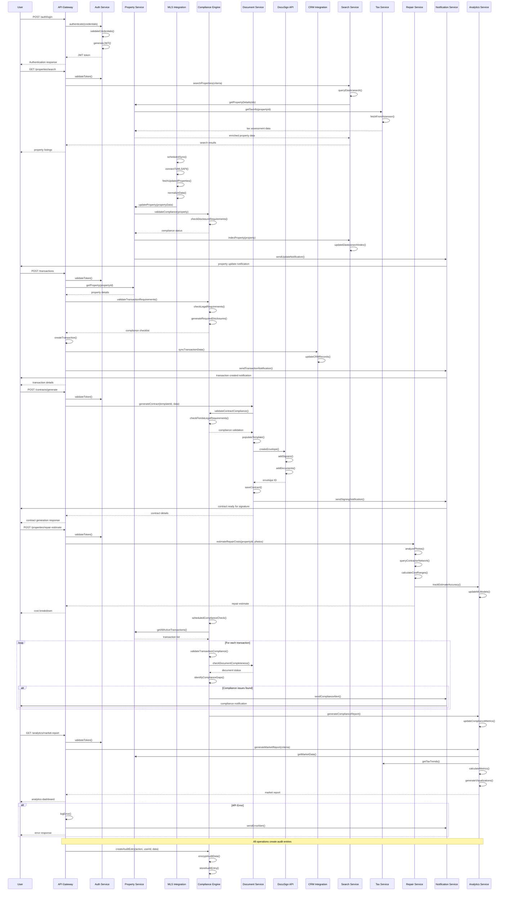

# Florida Real Estate Platform System Design

## Implementation Approach

Based on the comprehensive analysis of Florida real estate requirements, this system design addresses the complex needs of brokers, agents, and investors through a modular, cloud-native architecture. The platform prioritizes Florida-specific legal compliance, real-time data integration, and scalable automation workflows.

### Key Technical Challenges & Solutions

1. **Florida Legal Compliance Complexity**: Implement a rule-based compliance engine with automated form generation and validation
2. **Multi-MLS Integration**: Use RESO Web API standards with data normalization layer for heterogeneous MLS systems
3. **Real-time Data Synchronization**: Event-driven architecture with message queues for reliable data consistency
4. **Scalability for 10,000+ Users**: Microservices architecture with auto-scaling and load balancing
5. **Security & Audit Requirements**: Zero-trust architecture with comprehensive audit trails and encryption

### Technology Stack Selection

**Frontend**: Next.js 14 with TypeScript, Shadcn-ui components, and Tailwind CSS for rapid development and excellent UX
**Backend**: Node.js with NestJS framework for scalable microservices architecture
**Database**: PostgreSQL for transactional data, Elasticsearch for search, Redis for caching
**Integration**: GraphQL API gateway with REST endpoints for third-party integrations
**Infrastructure**: AWS cloud-native services with Kubernetes orchestration

## Data Structures and Interfaces

```mermaid
classDiagram
    class User {
        +id: string
        +email: string
        +role: UserRole
        +licenseNumber: string
        +brokerageId: string
        +profile: UserProfile
        +permissions: Permission[]
        +createdAt: Date
        +updatedAt: Date
        +authenticate(password: string): boolean
        +hasPermission(permission: string): boolean
        +updateProfile(profile: UserProfile): void
    }

    class Brokerage {
        +id: string
        +name: string
        +licenseNumber: string
        +address: Address
        +contactInfo: ContactInfo
        +agents: User[]
        +settings: BrokerageSettings
        +complianceConfig: ComplianceConfig
        +addAgent(agent: User): void
        +removeAgent(agentId: string): void
        +updateSettings(settings: BrokerageSettings): void
    }

    class Property {
        +id: string
        +mlsNumber: string
        +address: Address
        +propertyType: PropertyType
        +details: PropertyDetails
        +pricing: PropertyPricing
        +status: PropertyStatus
        +images: PropertyImage[]
        +disclosures: Disclosure[]
        +taxInfo: TaxAssessment
        +repairEstimates: RepairEstimate[]
        +createdAt: Date
        +updatedAt: Date
        +updateFromMLS(mlsData: MLSData): void
        +generateDisclosures(): Disclosure[]
        +calculateTaxes(): TaxCalculation
    }

    class Transaction {
        +id: string
        +propertyId: string
        +buyerAgentId: string
        +sellerAgentId: string
        +buyerId: string
        +sellerId: string
        +status: TransactionStatus
        +timeline: TransactionMilestone[]
        +contracts: Contract[]
        +documents: Document[]
        +complianceChecks: ComplianceCheck[]
        +createdAt: Date
        +updatedAt: Date
        +addMilestone(milestone: TransactionMilestone): void
        +generateContract(template: ContractTemplate): Contract
        +validateCompliance(): ComplianceResult
        +updateStatus(status: TransactionStatus): void
    }

    class Contract {
        +id: string
        +transactionId: string
        +templateId: string
        +type: ContractType
        +parties: ContractParty[]
        +terms: ContractTerms
        +signatures: Signature[]
        +status: ContractStatus
        +docusignEnvelopeId: string
        +auditTrail: AuditEntry[]
        +createdAt: Date
        +updatedAt: Date
        +generateFromTemplate(data: ContractData): void
        +sendForSignature(): void
        +validateLegalCompliance(): ComplianceResult
        +addSignature(signature: Signature): void
    }

    class MLSIntegration {
        +id: string
        +mlsProvider: string
        +apiEndpoint: string
        +credentials: APICredentials
        +lastSyncTime: Date
        +syncStatus: SyncStatus
        +dataMapping: FieldMapping[]
        +connect(): boolean
        +syncProperties(): Property[]
        +normalizeData(rawData: any): Property
        +handleErrors(error: Error): void
    }

    class CRMIntegration {
        +id: string
        +crmProvider: string
        +apiEndpoint: string
        +credentials: APICredentials
        +fieldMappings: FieldMapping[]
        +syncSettings: SyncSettings
        +lastSyncTime: Date
        +connect(): boolean
        +syncContacts(): Contact[]
        +syncLeads(): Lead[]
        +bidirectionalSync(): void
        +resolveConflicts(conflicts: DataConflict[]): void
    }

    class ComplianceEngine {
        +id: string
        +rules: ComplianceRule[]
        +templates: FormTemplate[]
        +auditConfig: AuditConfig
        +validateTransaction(transaction: Transaction): ComplianceResult
        +generateRequiredForms(property: Property): Document[]
        +checkDisclosureRequirements(property: Property): Disclosure[]
        +createAuditTrail(action: string, userId: string, data: any): AuditEntry
        +generateComplianceReport(): ComplianceReport
    }

    class DocumentService {
        +id: string
        +storage: StorageProvider
        +encryption: EncryptionService
        +templates: DocumentTemplate[]
        +uploadDocument(file: File, metadata: DocumentMetadata): Document
        +generateDocument(templateId: string, data: any): Document
        +signDocument(documentId: string, signers: Signer[]): SigningSession
        +retrieveDocument(documentId: string): Document
        +deleteDocument(documentId: string): boolean
    }

    class NotificationService {
        +id: string
        +channels: NotificationChannel[]
        +templates: NotificationTemplate[]
        +sendNotification(userId: string, message: Notification): void
        +sendBulkNotification(userIds: string[], message: Notification): void
        +scheduleNotification(notification: Notification, scheduleTime: Date): void
        +trackDelivery(notificationId: string): DeliveryStatus
    }

    class AnalyticsService {
        +id: string
        +dataWarehouse: DataWarehouse
        +reports: Report[]
        +dashboards: Dashboard[]
        +generateMarketReport(criteria: ReportCriteria): MarketReport
        +calculatePropertyMetrics(propertyId: string): PropertyMetrics
        +trackUserActivity(userId: string, activity: UserActivity): void
        +createCustomDashboard(userId: string, config: DashboardConfig): Dashboard
    }

    class SearchService {
        +id: string
        +elasticsearch: ElasticsearchClient
        +indices: SearchIndex[]
        +searchProperties(criteria: SearchCriteria): SearchResult[]
        +indexProperty(property: Property): void
        +updateIndex(propertyId: string, updates: any): void
        +deleteFromIndex(propertyId: string): void
        +suggestProperties(query: string): PropertySuggestion[]
    }

    class TaxService {
        +id: string
        +assessorAPIs: AssessorAPI[]
        +taxCalculator: TaxCalculator
        +getPropertyTaxInfo(propertyId: string): TaxAssessment
        +calculateProration(property: Property, closingDate: Date): TaxProration
        +checkAssessmentAccuracy(property: Property): AccuracyReport
        +updateTaxData(propertyId: string): void
    }

    class RepairEstimationService {
        +id: string
        +costDatabases: CostDatabase[]
        +aiAnalyzer: AIAnalyzer
        +contractorNetwork: ContractorNetwork
        +estimateRepairCosts(property: Property, photos: Image[]): RepairEstimate
        +analyzePropertyCondition(images: Image[]): ConditionReport
        +getContractorQuotes(repairItems: RepairItem[]): Quote[]
        +updateCostDatabase(actualCosts: ActualCost[]): void
    }

    %% Relationships
    User ||--o{ Transaction : manages
    User }o--|| Brokerage : belongs_to
    Property ||--o{ Transaction : involves
    Transaction ||--o{ Contract : contains
    Transaction ||--o{ Document : includes
    Contract ||--o{ Signature : requires
    Property ||--o{ Disclosure : has
    Property ||--|| TaxAssessment : assessed_for
    Property ||--o{ RepairEstimate : estimated_for
    MLSIntegration ||--o{ Property : syncs
    CRMIntegration ||--o{ User : syncs
    ComplianceEngine ||--o{ ComplianceRule : enforces
    DocumentService ||--o{ Document : manages
    SearchService ||--o{ Property : indexes
    TaxService ||--|| Property : assesses
    RepairEstimationService ||--|| Property : estimates
```

## Program Call Flow



## Anything UNCLEAR

Several aspects require clarification and additional specification:

1. **Specific MLS Provider APIs**: Need detailed API documentation for target Florida MLS systems (Miami REALTORS, Stellar MLS, etc.) to design precise integration specifications

2. **DocuSign Rooms Integration**: Require specific workflow requirements for real estate transaction document routing and approval processes

3. **Florida Legal Form Templates**: Need access to current FloridaRealtors-FloridaBar standardized forms to design accurate template management system

4. **CRM Integration Priorities**: Clarification needed on which CRM platforms to prioritize for Phase 1 implementation (Salesforce, HubSpot, kvCORE, etc.)

5. **Repair Cost Data Sources**: Specific APIs or databases for Florida contractor pricing and repair cost estimation need identification

6. **Tax Assessor API Availability**: Verification needed for API access across all 67 Florida counties or alternative data acquisition methods

7. **Mobile App Feature Parity**: Clarification on which features require full mobile functionality vs. mobile-responsive web interface

8. **Compliance Audit Requirements**: Specific FREC audit trail and reporting requirements need detailed specification

9. **Performance Requirements**: Specific SLA requirements for response times, uptime, and concurrent user capacity

10. **Data Retention Policies**: Detailed requirements for document retention periods and archival strategies for different data types

These clarifications will enable more precise technical specifications and implementation planning for the development team.