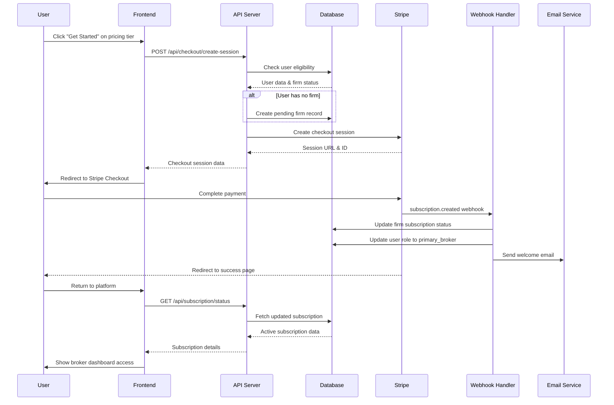
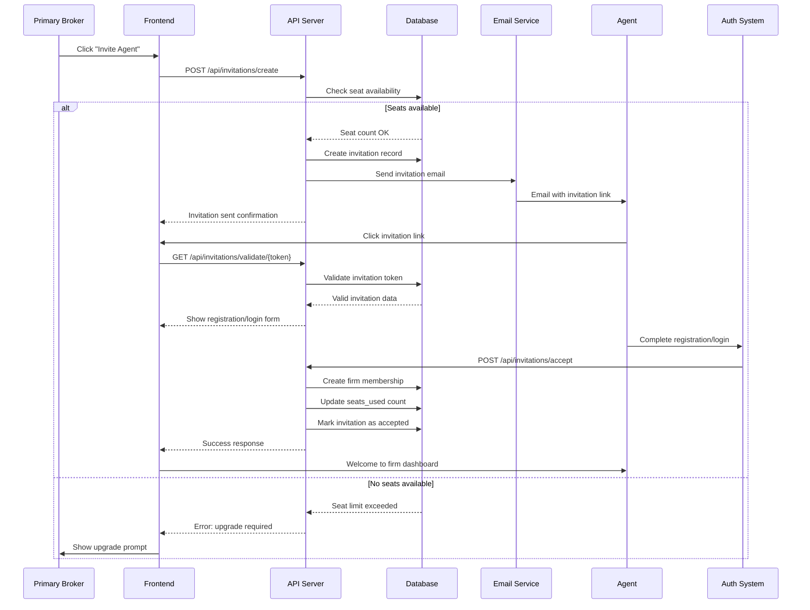
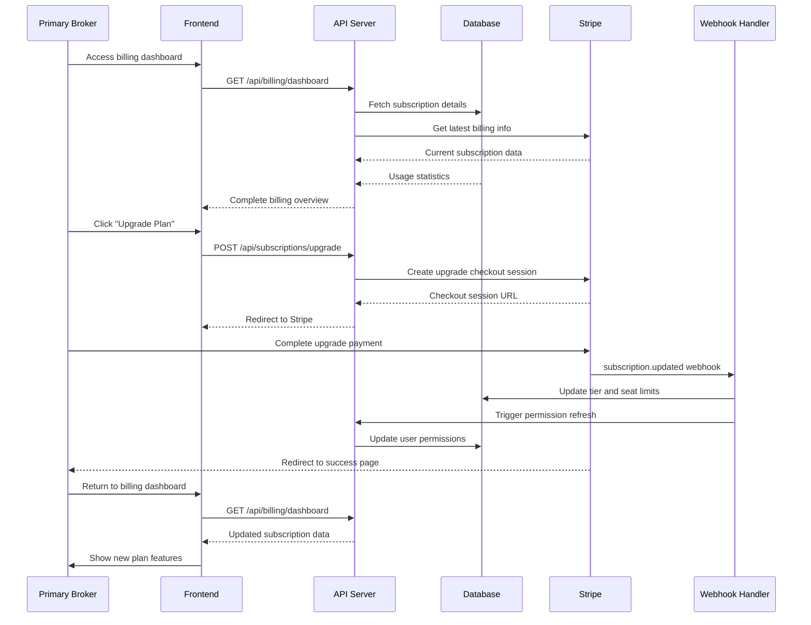
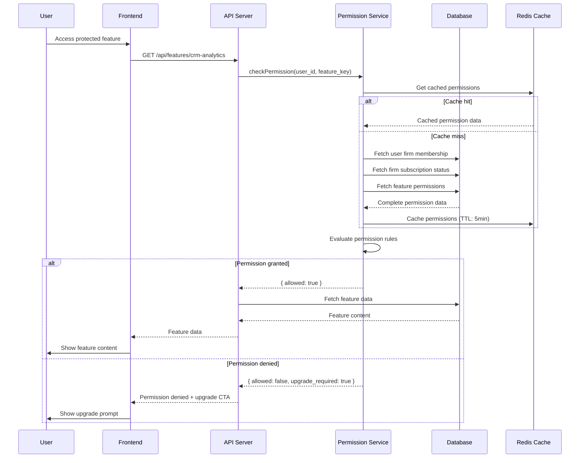

# Hatch Real Estate Platform - Pricing System Architecture

## Document Information
- **Product**: Hatch Real Estate Platform
- **Document Type**: System Architecture Design
- **Version**: 1.0
- **Date**: 2025-09-27
- **Based on**: pricing_system_prd.md v1.0

## Implementation Approach

We will implement a comprehensive subscription-based pricing system that integrates seamlessly with the existing Hatch platform. The architecture follows a microservices-inspired approach with clear separation of concerns:

**Key Technical Decisions:**
- **Stripe Integration**: Full Stripe ecosystem (Checkout, Billing Portal, Webhooks) for payment processing
- **Database Design**: PostgreSQL with Supabase for real-time subscriptions and RLS policies
- **Permission System**: Role-based access control (RBAC) with firm-level inheritance
- **API Architecture**: RESTful APIs with TypeScript interfaces for type safety
- **Frontend Framework**: React with Shadcn-ui components for consistent UX
- **State Management**: React Context for subscription state with local caching

**Difficult Points Analysis:**
1. **Seat Management Complexity**: Real-time seat counting with concurrent invitation handling
2. **Stripe Webhook Reliability**: Ensuring webhook delivery and idempotency
3. **Permission Inheritance**: Complex role hierarchies with firm-level subscription status
4. **Billing Edge Cases**: Prorated upgrades/downgrades with seat changes
5. **Data Consistency**: Maintaining sync between Stripe and local database

## Data Structures and Interfaces

### Database Schema Design

#### Core Tables

```sql
-- Firms/Companies Management
CREATE TABLE firms (
  id UUID PRIMARY KEY DEFAULT gen_random_uuid(),
  name VARCHAR(255) NOT NULL,
  slug VARCHAR(100) UNIQUE,
  
  -- Stripe Integration
  stripe_customer_id VARCHAR(255) UNIQUE,
  stripe_subscription_id VARCHAR(255) UNIQUE,
  
  -- Subscription Details
  subscription_status VARCHAR(50) DEFAULT 'inactive' CHECK (subscription_status IN ('inactive', 'active', 'trialing', 'past_due', 'canceled', 'unpaid')),
  tier VARCHAR(50) CHECK (tier IN ('basic', 'growth', 'elite', 'enterprise')),
  seats_purchased INTEGER DEFAULT 0,
  seats_used INTEGER DEFAULT 0,
  
  -- Billing Cycle
  current_period_start TIMESTAMP,
  current_period_end TIMESTAMP,
  trial_end TIMESTAMP,
  
  -- Metadata
  created_at TIMESTAMP DEFAULT NOW(),
  updated_at TIMESTAMP DEFAULT NOW(),
  
  -- Constraints
  CONSTRAINT valid_seat_usage CHECK (seats_used <= seats_purchased OR subscription_status = 'trialing')
);

-- Enhanced User Memberships
CREATE TABLE firm_memberships (
  id UUID PRIMARY KEY DEFAULT gen_random_uuid(),
  firm_id UUID NOT NULL REFERENCES firms(id) ON DELETE CASCADE,
  user_id UUID NOT NULL REFERENCES auth.users(id) ON DELETE CASCADE,
  
  -- Role Management
  role VARCHAR(50) NOT NULL DEFAULT 'agent' CHECK (role IN ('primary_broker', 'broker', 'agent', 'admin')),
  status VARCHAR(50) DEFAULT 'pending' CHECK (status IN ('pending', 'active', 'suspended', 'removed')),
  
  -- Invitation Tracking
  invited_by UUID REFERENCES auth.users(id),
  invitation_token VARCHAR(255) UNIQUE,
  invitation_expires_at TIMESTAMP,
  invited_at TIMESTAMP,
  joined_at TIMESTAMP,
  
  -- Permissions
  permissions JSONB DEFAULT '{}',
  
  -- Metadata
  created_at TIMESTAMP DEFAULT NOW(),
  updated_at TIMESTAMP DEFAULT NOW(),
  
  -- Constraints
  UNIQUE(firm_id, user_id),
  CONSTRAINT valid_invitation CHECK (
    (status = 'pending' AND invitation_token IS NOT NULL) OR 
    (status != 'pending' AND joined_at IS NOT NULL)
  )
);

-- Subscription History & Audit
CREATE TABLE subscription_events (
  id UUID PRIMARY KEY DEFAULT gen_random_uuid(),
  firm_id UUID NOT NULL REFERENCES firms(id) ON DELETE CASCADE,
  
  -- Event Details
  event_type VARCHAR(100) NOT NULL, -- 'subscription.created', 'subscription.updated', etc.
  stripe_event_id VARCHAR(255) UNIQUE,
  
  -- Change Tracking
  previous_data JSONB,
  new_data JSONB,
  
  -- Metadata
  processed_at TIMESTAMP DEFAULT NOW(),
  created_at TIMESTAMP DEFAULT NOW()
);

-- Billing & Invoice Tracking
CREATE TABLE billing_history (
  id UUID PRIMARY KEY DEFAULT gen_random_uuid(),
  firm_id UUID NOT NULL REFERENCES firms(id) ON DELETE CASCADE,
  
  -- Stripe References
  stripe_invoice_id VARCHAR(255) UNIQUE,
  stripe_payment_intent_id VARCHAR(255),
  
  -- Invoice Details
  amount_total INTEGER NOT NULL, -- in cents
  amount_paid INTEGER DEFAULT 0,
  currency VARCHAR(3) DEFAULT 'usd',
  status VARCHAR(50) NOT NULL,
  
  -- Billing Period
  period_start TIMESTAMP NOT NULL,
  period_end TIMESTAMP NOT NULL,
  
  -- Metadata
  invoice_url TEXT,
  created_at TIMESTAMP DEFAULT NOW()
);

-- Agent Invitations Management
CREATE TABLE agent_invitations (
  id UUID PRIMARY KEY DEFAULT gen_random_uuid(),
  firm_id UUID NOT NULL REFERENCES firms(id) ON DELETE CASCADE,
  invited_by UUID NOT NULL REFERENCES auth.users(id),
  
  -- Invitation Details
  email VARCHAR(255) NOT NULL,
  role VARCHAR(50) DEFAULT 'agent',
  token VARCHAR(255) UNIQUE NOT NULL,
  
  -- Status Tracking
  status VARCHAR(50) DEFAULT 'pending' CHECK (status IN ('pending', 'accepted', 'expired', 'revoked')),
  expires_at TIMESTAMP NOT NULL,
  accepted_at TIMESTAMP,
  accepted_by UUID REFERENCES auth.users(id),
  
  -- Metadata
  invitation_data JSONB DEFAULT '{}',
  created_at TIMESTAMP DEFAULT NOW(),
  
  -- Constraints
  CONSTRAINT valid_expiry CHECK (expires_at > created_at),
  CONSTRAINT unique_pending_invitation UNIQUE (firm_id, email, status) DEFERRABLE
);

-- Feature Access Control
CREATE TABLE feature_permissions (
  id UUID PRIMARY KEY DEFAULT gen_random_uuid(),
  
  -- Permission Details
  feature_key VARCHAR(100) NOT NULL,
  tier VARCHAR(50) NOT NULL,
  role VARCHAR(50) NOT NULL,
  
  -- Access Control
  is_enabled BOOLEAN DEFAULT true,
  usage_limit INTEGER, -- NULL = unlimited
  
  -- Metadata
  created_at TIMESTAMP DEFAULT NOW(),
  
  -- Constraints
  UNIQUE(feature_key, tier, role)
);
```

#### Enhanced Profiles Table

```sql
-- Extend existing profiles table
ALTER TABLE profiles 
ADD COLUMN firm_id UUID REFERENCES firms(id),
ADD COLUMN firm_role VARCHAR(50) DEFAULT 'none',
ADD COLUMN subscription_status VARCHAR(50) DEFAULT 'inactive',
ADD COLUMN last_billing_sync TIMESTAMP;

-- Create indexes for performance
CREATE INDEX idx_profiles_firm_id ON profiles(firm_id);
CREATE INDEX idx_firm_memberships_user_firm ON firm_memberships(user_id, firm_id);
CREATE INDEX idx_firms_stripe_customer ON firms(stripe_customer_id);
CREATE INDEX idx_firms_subscription_status ON firms(subscription_status);
```

### TypeScript Interfaces

```typescript
// Core Data Types
export interface Firm {
  id: string
  name: string
  slug: string
  stripe_customer_id?: string
  stripe_subscription_id?: string
  subscription_status: SubscriptionStatus
  tier?: PricingTier
  seats_purchased: number
  seats_used: number
  current_period_start?: Date
  current_period_end?: Date
  trial_end?: Date
  created_at: Date
  updated_at: Date
}

export interface FirmMembership {
  id: string
  firm_id: string
  user_id: string
  role: FirmRole
  status: MembershipStatus
  invited_by?: string
  invitation_token?: string
  invitation_expires_at?: Date
  invited_at?: Date
  joined_at?: Date
  permissions: Record<string, any>
  created_at: Date
  updated_at: Date
}

export interface AgentInvitation {
  id: string
  firm_id: string
  invited_by: string
  email: string
  role: FirmRole
  token: string
  status: InvitationStatus
  expires_at: Date
  accepted_at?: Date
  accepted_by?: string
  invitation_data: Record<string, any>
  created_at: Date
}

// Enums and Constants
export type SubscriptionStatus = 
  | 'inactive' 
  | 'active' 
  | 'trialing' 
  | 'past_due' 
  | 'canceled' 
  | 'unpaid'

export type PricingTier = 'basic' | 'growth' | 'elite' | 'enterprise'

export type FirmRole = 'primary_broker' | 'broker' | 'agent' | 'admin'

export type MembershipStatus = 'pending' | 'active' | 'suspended' | 'removed'

export type InvitationStatus = 'pending' | 'accepted' | 'expired' | 'revoked'

// Pricing Configuration
export interface PricingPlan {
  id: PricingTier
  name: string
  price: number
  currency: string
  billing_interval: 'month' | 'year'
  stripe_price_id: string
  features: PlanFeature[]
  limits: PlanLimits
}

export interface PlanFeature {
  key: string
  name: string
  description: string
  included: boolean
  limit?: number
}

export interface PlanLimits {
  max_agents: number
  storage_per_agent_gb: number
  api_calls_per_month?: number
  custom_integrations: boolean
  priority_support: boolean
}

// Stripe Integration Types
export interface StripeCheckoutSession {
  session_id: string
  url: string
  expires_at: Date
}

export interface StripeWebhookEvent {
  id: string
  type: string
  data: {
    object: any
  }
  created: number
}

// API Response Types
export interface SubscriptionResponse {
  firm: Firm
  membership: FirmMembership
  current_plan: PricingPlan
  usage: {
    seats_used: number
    seats_available: number
    storage_used_gb: number
    api_calls_used: number
  }
  billing: {
    next_billing_date: Date
    amount_due: number
    payment_method?: {
      type: string
      last4?: string
    }
  }
}

// Permission System Types
export interface PermissionCheck {
  feature_key: string
  user_id: string
  firm_id?: string
}

export interface PermissionResult {
  allowed: boolean
  reason?: string
  upgrade_required?: boolean
  suggested_tier?: PricingTier
}
```

## Program Call Flow

### Subscription Creation Flow



### Agent Invitation Flow



### Subscription Management Flow



### Permission Enforcement Flow



## API Design Specifications

### Core API Endpoints

```typescript
// Pricing & Plans API
interface PricingAPI {
  'GET /api/pricing/plans': {
    response: PricingPlan[]
  }
  
  'GET /api/pricing/plans/:tier': {
    params: { tier: PricingTier }
    response: PricingPlan
  }
}

// Subscription Management API
interface SubscriptionAPI {
  'POST /api/subscriptions/checkout': {
    body: {
      tier: PricingTier
      billing_interval: 'month' | 'year'
      firm_id?: string
    }
    response: StripeCheckoutSession
  }
  
  'GET /api/subscriptions/current': {
    response: SubscriptionResponse
  }
  
  'POST /api/subscriptions/upgrade': {
    body: {
      new_tier: PricingTier
      billing_interval?: 'month' | 'year'
    }
    response: StripeCheckoutSession
  }
  
  'POST /api/subscriptions/cancel': {
    body: {
      reason?: string
      cancel_at_period_end: boolean
    }
    response: { success: boolean; effective_date: Date }
  }
  
  'GET /api/subscriptions/portal': {
    response: { url: string }
  }
}

// Agent Management API
interface AgentAPI {
  'POST /api/invitations/create': {
    body: {
      email: string
      role: FirmRole
      permissions?: Record<string, any>
    }
    response: AgentInvitation
  }
  
  'GET /api/invitations/list': {
    query: {
      status?: InvitationStatus
      limit?: number
      offset?: number
    }
    response: {
      invitations: AgentInvitation[]
      total: number
    }
  }
  
  'POST /api/invitations/accept': {
    body: {
      token: string
      user_data?: {
        first_name: string
        last_name: string
      }
    }
    response: FirmMembership
  }
  
  'DELETE /api/invitations/:id': {
    params: { id: string }
    response: { success: boolean }
  }
  
  'GET /api/agents/list': {
    query: {
      firm_id?: string
      status?: MembershipStatus
      role?: FirmRole
    }
    response: {
      members: (FirmMembership & { user: Profile })[]
      total: number
    }
  }
  
  'PUT /api/agents/:id/role': {
    params: { id: string }
    body: {
      role: FirmRole
      permissions?: Record<string, any>
    }
    response: FirmMembership
  }
  
  'DELETE /api/agents/:id': {
    params: { id: string }
    response: { success: boolean }
  }
}

// Billing & Usage API
interface BillingAPI {
  'GET /api/billing/dashboard': {
    response: {
      subscription: SubscriptionResponse
      usage: {
        current_period: {
          seats_used: number
          api_calls: number
          storage_gb: number
        }
        historical: Array<{
          period: string
          seats_used: number
          api_calls: number
        }>
      }
      invoices: Array<{
        id: string
        amount: number
        status: string
        date: Date
        download_url: string
      }>
    }
  }
  
  'GET /api/billing/usage': {
    query: {
      start_date?: string
      end_date?: string
      metric?: 'seats' | 'api_calls' | 'storage'
    }
    response: {
      metrics: Array<{
        date: string
        value: number
        limit?: number
      }>
    }
  }
  
  'GET /api/billing/invoices': {
    query: {
      limit?: number
      offset?: number
      status?: string
    }
    response: {
      invoices: BillingHistory[]
      total: number
    }
  }
}

// Permissions API
interface PermissionsAPI {
  'POST /api/permissions/check': {
    body: {
      feature_key: string
      user_id?: string
      firm_id?: string
    }
    response: PermissionResult
  }
  
  'GET /api/permissions/features': {
    query: {
      tier?: PricingTier
      role?: FirmRole
    }
    response: {
      features: Array<{
        key: string
        name: string
        allowed: boolean
        limit?: number
      }>
    }
  }
  
  'POST /api/permissions/bulk-check': {
    body: {
      checks: PermissionCheck[]
    }
    response: {
      results: Record<string, PermissionResult>
    }
  }
}

// Webhook Handler API
interface WebhookAPI {
  'POST /api/webhooks/stripe': {
    headers: {
      'stripe-signature': string
    }
    body: StripeWebhookEvent
    response: { received: boolean }
  }
}
```

### Error Handling Standards

```typescript
// Standard Error Response Format
interface APIError {
  error: {
    code: string
    message: string
    details?: Record<string, any>
    timestamp: string
    request_id: string
  }
}

// Common Error Codes
export const ErrorCodes = {
  // Authentication & Authorization
  UNAUTHORIZED: 'UNAUTHORIZED',
  FORBIDDEN: 'FORBIDDEN',
  INVALID_TOKEN: 'INVALID_TOKEN',
  
  // Subscription Errors
  SUBSCRIPTION_REQUIRED: 'SUBSCRIPTION_REQUIRED',
  SEAT_LIMIT_EXCEEDED: 'SEAT_LIMIT_EXCEEDED',
  INVALID_TIER: 'INVALID_TIER',
  PAYMENT_FAILED: 'PAYMENT_FAILED',
  
  // Invitation Errors
  INVITATION_EXPIRED: 'INVITATION_EXPIRED',
  INVITATION_ALREADY_ACCEPTED: 'INVITATION_ALREADY_ACCEPTED',
  DUPLICATE_INVITATION: 'DUPLICATE_INVITATION',
  
  // Validation Errors
  VALIDATION_ERROR: 'VALIDATION_ERROR',
  MISSING_REQUIRED_FIELD: 'MISSING_REQUIRED_FIELD',
  
  // System Errors
  INTERNAL_SERVER_ERROR: 'INTERNAL_SERVER_ERROR',
  SERVICE_UNAVAILABLE: 'SERVICE_UNAVAILABLE',
  RATE_LIMIT_EXCEEDED: 'RATE_LIMIT_EXCEEDED'
} as const
```

## Component Architecture

### Frontend Component Hierarchy

```typescript
// Main Pricing Components
export const PricingComponents = {
  // Public Pricing Page
  PricingPage: {
    path: '/pricing',
    components: [
      'PricingHeader',
      'PricingTiers',
      'FeatureComparison', 
      'FAQ',
      'CTA'
    ]
  },
  
  // Subscription Management
  SubscriptionDashboard: {
    path: '/broker/billing',
    components: [
      'SubscriptionOverview',
      'UsageMetrics',
      'BillingHistory',
      'PaymentMethods',
      'PlanUpgrade'
    ]
  },
  
  // Agent Management
  AgentManagement: {
    path: '/broker/team',
    components: [
      'AgentList',
      'InviteAgent',
      'PendingInvitations',
      'RoleManagement',
      'PermissionEditor'
    ]
  }
}

// Core Component Interfaces
interface PricingTierProps {
  plan: PricingPlan
  currentTier?: PricingTier
  isPopular?: boolean
  onSelect: (tier: PricingTier) => void
}

interface SubscriptionOverviewProps {
  subscription: SubscriptionResponse
  onUpgrade: () => void
  onManageBilling: () => void
}

interface AgentInviteProps {
  availableSeats: number
  onInvite: (email: string, role: FirmRole) => Promise<void>
  isLoading: boolean
}
```

### State Management Architecture

```typescript
// Subscription Context
interface SubscriptionContextType {
  // Current State
  subscription: SubscriptionResponse | null
  loading: boolean
  error: string | null
  
  // Actions
  loadSubscription: () => Promise<void>
  createCheckoutSession: (tier: PricingTier) => Promise<string>
  upgradeSubscription: (tier: PricingTier) => Promise<void>
  cancelSubscription: (reason?: string) => Promise<void>
  
  // Agent Management
  inviteAgent: (email: string, role: FirmRole) => Promise<void>
  removeAgent: (memberId: string) => Promise<void>
  updateAgentRole: (memberId: string, role: FirmRole) => Promise<void>
  
  // Permissions
  checkPermission: (feature: string) => boolean
  getUpgradePrompt: (feature: string) => UpgradePrompt | null
}

// Permission Hook
interface UsePermissionsReturn {
  hasAccess: (feature: string) => boolean
  requiresUpgrade: (feature: string) => boolean
  getFeatureLimit: (feature: string) => number | null
  checkUsage: (feature: string) => { used: number; limit: number }
}

// Usage Hook
interface UseSubscriptionReturn {
  subscription: SubscriptionResponse | null
  isLoading: boolean
  error: string | null
  refetch: () => Promise<void>
  
  // Quick access
  currentTier: PricingTier | null
  seatsAvailable: number
  isActive: boolean
  nextBillingDate: Date | null
}
```

## Integration Patterns

### Stripe Integration Architecture

```typescript
// Stripe Service Layer
export class StripeService {
  private stripe: Stripe
  
  constructor(secretKey: string) {
    this.stripe = new Stripe(secretKey, {
      apiVersion: '2023-10-16'
    })
  }
  
  // Checkout Session Management
  async createCheckoutSession(params: {
    priceId: string
    customerId?: string
    metadata: Record<string, string>
    successUrl: string
    cancelUrl: string
  }): Promise<Stripe.Checkout.Session> {
    return await this.stripe.checkout.sessions.create({
      mode: 'subscription',
      payment_method_types: ['card'],
      line_items: [{
        price: params.priceId,
        quantity: 1
      }],
      customer: params.customerId,
      metadata: params.metadata,
      success_url: params.successUrl,
      cancel_url: params.cancelUrl,
      allow_promotion_codes: true,
      billing_address_collection: 'required',
      automatic_tax: { enabled: true }
    })
  }
  
  // Subscription Management
  async updateSubscription(subscriptionId: string, params: {
    priceId?: string
    quantity?: number
    prorationBehavior?: 'create_prorations' | 'none'
  }): Promise<Stripe.Subscription> {
    const subscription = await this.stripe.subscriptions.retrieve(subscriptionId)
    
    return await this.stripe.subscriptions.update(subscriptionId, {
      items: [{
        id: subscription.items.data[0].id,
        price: params.priceId,
        quantity: params.quantity
      }],
      proration_behavior: params.prorationBehavior || 'create_prorations'
    })
  }
  
  // Customer Portal
  async createPortalSession(customerId: string, returnUrl: string): Promise<Stripe.BillingPortal.Session> {
    return await this.stripe.billingPortal.sessions.create({
      customer: customerId,
      return_url: returnUrl
    })
  }
}

// Webhook Handler
export class StripeWebhookHandler {
  constructor(
    private stripeService: StripeService,
    private subscriptionService: SubscriptionService
  ) {}
  
  async handleWebhook(event: Stripe.Event): Promise<void> {
    switch (event.type) {
      case 'customer.subscription.created':
        await this.handleSubscriptionCreated(event.data.object as Stripe.Subscription)
        break
        
      case 'customer.subscription.updated':
        await this.handleSubscriptionUpdated(event.data.object as Stripe.Subscription)
        break
        
      case 'customer.subscription.deleted':
        await this.handleSubscriptionDeleted(event.data.object as Stripe.Subscription)
        break
        
      case 'invoice.payment_succeeded':
        await this.handlePaymentSucceeded(event.data.object as Stripe.Invoice)
        break
        
      case 'invoice.payment_failed':
        await this.handlePaymentFailed(event.data.object as Stripe.Invoice)
        break
    }
  }
  
  private async handleSubscriptionCreated(subscription: Stripe.Subscription): Promise<void> {
    const customerId = subscription.customer as string
    const firm = await this.subscriptionService.findFirmByStripeCustomerId(customerId)
    
    if (firm) {
      await this.subscriptionService.activateSubscription({
        firmId: firm.id,
        stripeSubscriptionId: subscription.id,
        tier: this.extractTierFromSubscription(subscription),
        currentPeriodStart: new Date(subscription.current_period_start * 1000),
        currentPeriodEnd: new Date(subscription.current_period_end * 1000)
      })
    }
  }
}
```

### Permission System Integration

```typescript
// Permission Service
export class PermissionService {
  constructor(
    private db: Database,
    private cache: RedisCache
  ) {}
  
  async checkPermission(params: PermissionCheck): Promise<PermissionResult> {
    const cacheKey = `permission:${params.user_id}:${params.feature_key}`
    
    // Check cache first
    const cached = await this.cache.get(cacheKey)
    if (cached) {
      return JSON.parse(cached)
    }
    
    // Fetch user's firm membership and subscription
    const membership = await this.db.query(`
      SELECT fm.*, f.subscription_status, f.tier 
      FROM firm_memberships fm
      JOIN firms f ON fm.firm_id = f.id
      WHERE fm.user_id = $1 AND fm.status = 'active'
    `, [params.user_id])
    
    if (!membership.length) {
      return { allowed: false, reason: 'No active firm membership' }
    }
    
    const { subscription_status, tier, role } = membership[0]
    
    // Check feature permissions
    const featurePermission = await this.db.query(`
      SELECT * FROM feature_permissions 
      WHERE feature_key = $1 AND tier = $2 AND role = $3
    `, [params.feature_key, tier, role])
    
    const result: PermissionResult = {
      allowed: featurePermission.length > 0 && 
               featurePermission[0].is_enabled && 
               subscription_status === 'active',
      upgrade_required: subscription_status !== 'active' || !featurePermission.length
    }
    
    // Cache result for 5 minutes
    await this.cache.setex(cacheKey, 300, JSON.stringify(result))
    
    return result
  }
  
  // Permission Middleware for API Routes
  createPermissionMiddleware(featureKey: string) {
    return async (req: Request, res: Response, next: NextFunction) => {
      const userId = req.user?.id
      if (!userId) {
        return res.status(401).json({ error: 'Unauthorized' })
      }
      
      const permission = await this.checkPermission({
        feature_key: featureKey,
        user_id: userId
      })
      
      if (!permission.allowed) {
        return res.status(403).json({
          error: 'Feature access denied',
          upgrade_required: permission.upgrade_required,
          suggested_tier: permission.suggested_tier
        })
      }
      
      next()
    }
  }
}
```

### Database Integration Patterns

```typescript
// Subscription Service
export class SubscriptionService {
  constructor(private db: SupabaseClient) {}
  
  async createFirm(params: {
    name: string
    ownerId: string
    tier?: PricingTier
  }): Promise<Firm> {
    const { data, error } = await this.db
      .from('firms')
      .insert({
        name: params.name,
        tier: params.tier,
        subscription_status: params.tier ? 'trialing' : 'inactive'
      })
      .select()
      .single()
    
    if (error) throw error
    
    // Create primary broker membership
    await this.db
      .from('firm_memberships')
      .insert({
        firm_id: data.id,
        user_id: params.ownerId,
        role: 'primary_broker',
        status: 'active',
        joined_at: new Date().toISOString()
      })
    
    return data
  }
  
  async inviteAgent(params: {
    firmId: string
    email: string
    role: FirmRole
    invitedBy: string
  }): Promise<AgentInvitation> {
    // Check seat availability
    const firm = await this.getFirm(params.firmId)
    if (firm.seats_used >= firm.seats_purchased) {
      throw new Error('Seat limit exceeded')
    }
    
    // Create invitation
    const token = crypto.randomUUID()
    const expiresAt = new Date(Date.now() + 7 * 24 * 60 * 60 * 1000) // 7 days
    
    const { data, error } = await this.db
      .from('agent_invitations')
      .insert({
        firm_id: params.firmId,
        email: params.email,
        role: params.role,
        invited_by: params.invitedBy,
        token,
        expires_at: expiresAt.toISOString()
      })
      .select()
      .single()
    
    if (error) throw error
    
    return data
  }
  
  async acceptInvitation(token: string, userId: string): Promise<FirmMembership> {
    // Start transaction
    const { data: invitation, error: inviteError } = await this.db
      .from('agent_invitations')
      .select('*')
      .eq('token', token)
      .eq('status', 'pending')
      .single()
    
    if (inviteError || !invitation) {
      throw new Error('Invalid or expired invitation')
    }
    
    // Check if invitation is still valid
    if (new Date(invitation.expires_at) < new Date()) {
      await this.db
        .from('agent_invitations')
        .update({ status: 'expired' })
        .eq('id', invitation.id)
      
      throw new Error('Invitation has expired')
    }
    
    // Create firm membership
    const { data: membership, error: memberError } = await this.db
      .from('firm_memberships')
      .insert({
        firm_id: invitation.firm_id,
        user_id: userId,
        role: invitation.role,
        status: 'active',
        invited_by: invitation.invited_by,
        joined_at: new Date().toISOString()
      })
      .select()
      .single()
    
    if (memberError) throw memberError
    
    // Update invitation status and firm seat count
    await Promise.all([
      this.db
        .from('agent_invitations')
        .update({ 
          status: 'accepted',
          accepted_at: new Date().toISOString(),
          accepted_by: userId
        })
        .eq('id', invitation.id),
      
      this.db.rpc('increment_seats_used', { firm_id: invitation.firm_id })
    ])
    
    return membership
  }
}
```

## Anything UNCLEAR

1. **Trial Period Implementation**: The PRD mentions trial periods but doesn't specify the exact duration or limitations. Should we implement a 14-day free trial for all plans, or different trial periods per tier?

2. **Enterprise Plan Pricing**: How should we handle custom enterprise pricing in the system? Should we create a separate workflow for enterprise sales, or integrate it into the standard checkout flow?

3. **Seat Overage Handling**: What happens when a firm exceeds their seat limit? Should we automatically block new invitations, charge overage fees, or force an immediate upgrade?

4. **Data Migration Strategy**: How do we handle existing users when launching the paid tiers? Should we grandfather existing users into a free tier, or automatically assign them to a paid plan?

5. **International Considerations**: Do we need to handle different currencies, tax rates, or regional pricing from day one, or can this be added later?

6. **Webhook Reliability**: How do we handle webhook delivery failures or duplicate events? Should we implement a retry mechanism or manual reconciliation process?

7. **Permission Granularity**: How granular should the permission system be? Should we control access at the feature level, API endpoint level, or both?

8. **Billing Cycle Alignment**: When users upgrade/downgrade mid-cycle, how do we handle prorated billing and feature access timing?

These questions should be clarified before implementation to ensure the system meets all business requirements and handles edge cases appropriately.