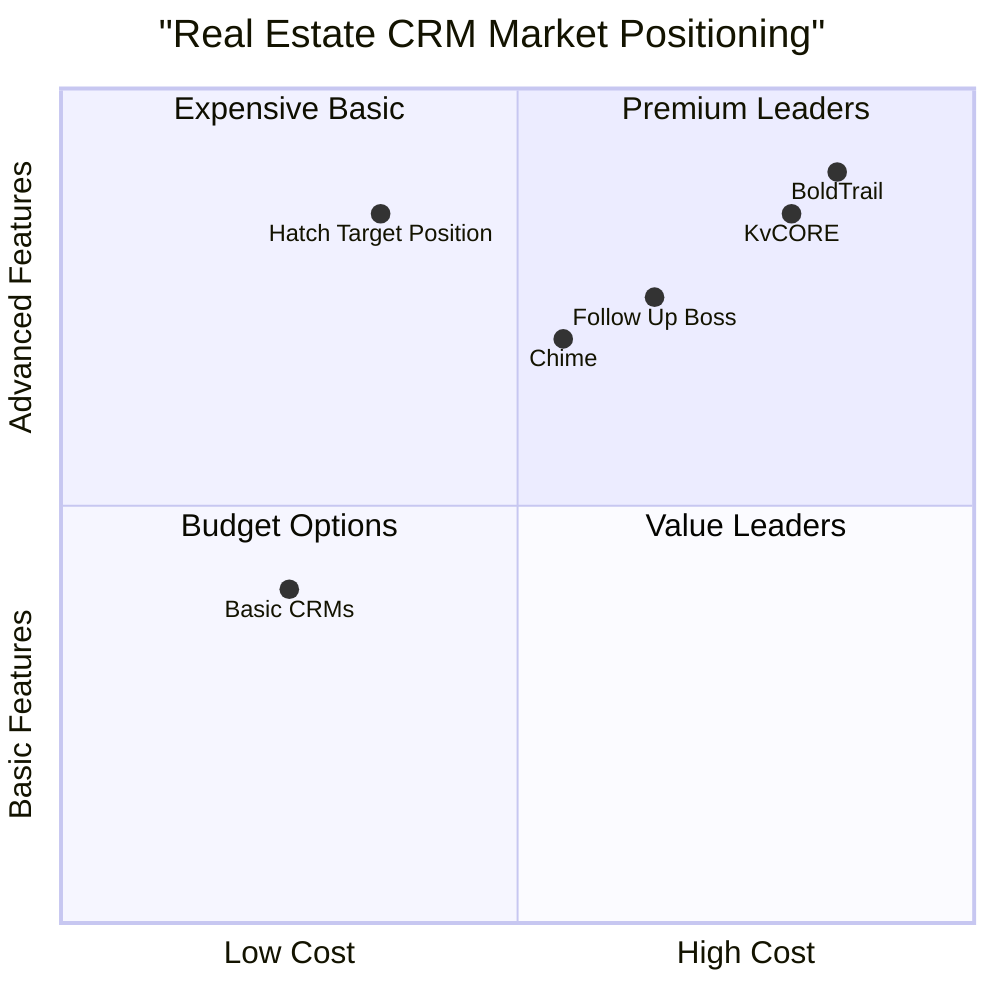

# Hatch Real Estate Platform - Pricing & Subscription System PRD

## Document Information
- **Product**: Hatch Real Estate Platform
- **Document Type**: Product Requirements Document (PRD)
- **Version**: 1.0
- **Date**: 2025-09-27
- **Language**: English
- **Programming Languages**: TypeScript, React, Tailwind CSS, Shadcn-ui
- **Project Name**: hatch_pricing_system

## Original Requirements Restatement

Implement a comprehensive pricing/upgrade system that allows brokers to:
- Review tiered pricing plans similar to BoldTrail but more affordable
- Purchase subscriptions via Stripe checkout
- Upgrade to "broker account" status with enhanced permissions
- Invite and manage agents within seat limits
- Access billing management and upgrade/downgrade functionality

**Core Mandate**: Do not replace existing functionality - only build onto the current platform.

## Product Definition

### Product Goals

1. **Revenue Generation**: Create a sustainable, scalable subscription revenue model through tiered pricing that captures value across different broker sizes and needs
2. **Market Positioning**: Establish Hatch as the affordable alternative to premium real estate CRM solutions like BoldTrail while maintaining feature parity
3. **User Growth**: Enable organic growth through agent invitation systems and clear upgrade paths that encourage platform adoption

### User Stories

#### Primary Broker Stories
- **As a solo real estate agent**, I want to upgrade to a Basic Broker plan so that I can access advanced CRM features and invite up to 25 team members
- **As a growing brokerage owner**, I want to compare pricing tiers and upgrade to Growth or Elite plans so that I can scale my team and access premium analytics
- **As a large brokerage**, I want custom enterprise pricing so that I can negotiate terms that fit my specific needs and agent count

#### Agent Stories
- **As an invited agent**, I want to accept broker invitations so that I can join a firm and access the platform's tools within my assigned permissions
- **As a team member**, I want clear visibility into my access level so that I understand which features I can use based on my firm's subscription

#### Administrative Stories
- **As a Primary Broker**, I want to manage my subscription and billing so that I can upgrade/downgrade plans, view usage, and control costs
- **As a Primary Broker**, I want to invite agents up to my seat limit so that I can build my team while staying within subscription boundaries

### Competitive Analysis

#### Market Research Findings

Based on industry analysis, real estate CRM pricing typically follows these patterns:

**Industry Benchmarks:**
- **BoldTrail**: ~$5,988/year + $999 setup fee per person (premium positioning)
- **Market Range**: $20-200+ per user per month depending on features
- **Common Tiers**: Solo ($20-50/month), Team ($50-100/month), Enterprise ($100+/month)
- **Seat-Based Models**: Most platforms charge per active user with bulk discounts

**Competitive Landscape:**

| Platform | Positioning | Pricing Model | Key Strengths | Key Weaknesses |
|----------|-------------|---------------|---------------|----------------|
| BoldTrail | Premium | Custom quotes, ~$500/month/user | Comprehensive features, established brand | Very expensive, complex setup |
| Chime | Mid-Market | $40-80/user/month | Good CRM features, reasonable pricing | Limited customization |
| Follow Up Boss | Growth-Focused | $69-89/user/month | Strong lead management | Expensive for large teams |
| KvCORE | Enterprise | $100+/user/month | Advanced automation | Complex, expensive |
| **Hatch (Our Position)** | **Affordable Premium** | **Tiered seat-based** | **Full features at lower cost** | **New to market** |

#### Competitive Quadrant Chart



## Technical Specifications

### Requirements Analysis

The pricing system requires integration across multiple platform layers:

**Frontend Requirements:**
- Public pricing page accessible to all users
- Stripe checkout integration with plan selection
- Subscription management dashboard for brokers
- Agent invitation and management interfaces
- Role-based feature access controls

**Backend Requirements:**
- Stripe webhook handling for subscription events
- Database schema for firms, subscriptions, and seat management
- Role and permission enforcement system
- Agent invitation and onboarding workflows
- Billing and usage tracking

**Integration Requirements:**
- Stripe API for payment processing and subscription management
- Email service for agent invitations
- Existing authentication and role system enhancement
- Current CRM and property management feature gating

### Requirements Pool

#### P0 (Must-Have) Requirements

1. **Pricing Page Implementation**
   - Public pricing page with 4 tiers (Basic, Growth, Elite, Enterprise)
   - Responsive design matching current platform aesthetics
   - Clear feature comparison and value propositions
   - Call-to-action buttons for each tier

2. **Stripe Integration**
   - Stripe Checkout session creation for each plan
   - Webhook handling for subscription lifecycle events
   - Secure payment processing with error handling
   - Subscription status synchronization with database

3. **Subscription Management**
   - Database schema for firms, subscriptions, and seats
   - Automatic role upgrades upon successful payment
   - Seat limit enforcement for agent invitations
   - Basic billing dashboard in broker panel

4. **Agent Management System**
   - Email-based agent invitation system
   - Seat count validation before sending invites
   - Agent onboarding workflow with firm assignment
   - Basic permission enforcement based on subscription tier

#### P1 (Should-Have) Requirements

1. **Advanced Billing Features**
   - Upgrade/downgrade plan functionality
   - Prorated billing calculations
   - Stripe Customer Portal integration
   - Usage analytics and reporting

2. **Enhanced Permission System**
   - Granular feature access control per tier
   - Custom permission sets for different agent roles
   - Feature usage tracking and limits
   - Advanced admin controls for Primary Brokers

3. **Subscription Lifecycle Management**
   - Trial period handling
   - Automatic renewal processing
   - Failed payment recovery workflows
   - Cancellation and reactivation processes

#### P2 (Nice-to-Have) Requirements

1. **Advanced Features**
   - Multi-currency support for international markets
   - Custom enterprise plan negotiation tools
   - Advanced analytics and usage insights
   - Integration with accounting systems

2. **User Experience Enhancements**
   - In-app upgrade prompts and recommendations
   - Onboarding tutorials for new subscribers
   - Advanced notification system for billing events
   - Mobile-optimized billing management

### Pricing Strategy & Tiers

#### Recommended Pricing Structure

**Basic Broker Plan - $79/month**
- Up to 25 agents
- Core CRM features
- Basic property management
- Standard support
- 5GB storage per agent

**Growth Broker Plan - $149/month**
- Up to 50 agents
- Advanced CRM with automation
- Full property management suite
- Priority support
- 10GB storage per agent
- Basic analytics dashboard

**Elite Broker Plan - $249/month**
- Up to 100 agents
- Premium CRM with AI features
- Advanced analytics and reporting
- White-label options
- 25GB storage per agent
- Dedicated account manager

**Enterprise Plan - Custom Pricing**
- Unlimited agents
- Custom integrations
- Advanced security features
- On-premise deployment options
- Custom storage limits
- 24/7 premium support

#### Value Proposition Analysis

**Competitive Advantage:**
- 60-70% cost savings compared to BoldTrail
- No setup fees (vs. BoldTrail's $999 setup cost)
- Transparent pricing (vs. custom quotes only)
- Full feature access at lower tiers
- Scalable seat-based model

### UI Design Draft

#### Pricing Page Layout

```
Header: "Choose Your Plan" with value proposition
Tier Cards (4 columns on desktop, stacked on mobile):
┌─────────────────┬─────────────────┬─────────────────┬─────────────────┐
│   Basic Broker  │  Growth Broker  │   Elite Broker  │   Enterprise    │
│     $79/mo      │    $149/mo      │    $249/mo      │  Custom Pricing │
├─────────────────┼─────────────────┼─────────────────┼─────────────────┤
│ • Up to 25      │ • Up to 50      │ • Up to 100     │ • Unlimited     │
│   agents        │   agents        │   agents        │   agents        │
│ • Core CRM      │ • Advanced CRM  │ • Premium CRM   │ • Custom        │
│ • Basic Props   │ • Full Props    │ • Advanced      │   integrations  │
│ • Standard      │ • Priority      │   Analytics     │ • Enterprise    │
│   Support       │   Support       │ • White-label   │   Security      │
│                 │ • Automation    │ • Dedicated     │ • 24/7 Support  │
│                 │                 │   Manager       │                 │
├─────────────────┼─────────────────┼─────────────────┼─────────────────┤
│ [Get Started]   │ [Get Started]   │ [Get Started]   │ [Contact Sales] │
└─────────────────┴─────────────────┴─────────────────┴─────────────────┘
```

#### Billing Dashboard Layout

```
Subscription Overview Section:
┌─────────────────────────────────────────────────────────────────┐
│ Current Plan: Growth Broker ($149/month)                       │
│ Next Billing: October 27, 2025                                 │
│ Agents: 23/50 used                                             │
│ [Upgrade Plan] [Manage Billing] [Download Invoice]             │
└─────────────────────────────────────────────────────────────────┘

Agent Management Section:
┌─────────────────────────────────────────────────────────────────┐
│ Team Members (23/50)                              [Invite Agent]│
│ ┌─────────────────────────────────────────────────────────────┐ │
│ │ Name          Email              Role        Status    Action│ │
│ │ John Smith    john@email.com     Agent       Active    [...]│ │
│ │ Jane Doe      jane@email.com     Agent       Pending   [...]│ │
│ └─────────────────────────────────────────────────────────────┘ │
└─────────────────────────────────────────────────────────────────┘
```

### Database Schema Requirements

#### New Tables

**firms**
```sql
CREATE TABLE firms (
  id UUID PRIMARY KEY DEFAULT gen_random_uuid(),
  name VARCHAR(255) NOT NULL,
  stripe_customer_id VARCHAR(255),
  stripe_subscription_id VARCHAR(255),
  subscription_status VARCHAR(50) DEFAULT 'inactive',
  tier VARCHAR(50), -- 'basic', 'growth', 'elite', 'enterprise'
  seats_purchased INTEGER DEFAULT 0,
  seats_used INTEGER DEFAULT 0,
  created_at TIMESTAMP DEFAULT NOW(),
  updated_at TIMESTAMP DEFAULT NOW()
);
```

**firm_memberships**
```sql
CREATE TABLE firm_memberships (
  id UUID PRIMARY KEY DEFAULT gen_random_uuid(),
  firm_id UUID REFERENCES firms(id),
  user_id UUID REFERENCES auth.users(id),
  role VARCHAR(50) DEFAULT 'agent', -- 'primary_broker', 'agent'
  status VARCHAR(50) DEFAULT 'active', -- 'active', 'pending', 'inactive'
  invited_by UUID REFERENCES auth.users(id),
  invited_at TIMESTAMP,
  joined_at TIMESTAMP,
  created_at TIMESTAMP DEFAULT NOW()
);
```

**subscriptions**
```sql
CREATE TABLE subscriptions (
  id UUID PRIMARY KEY DEFAULT gen_random_uuid(),
  firm_id UUID REFERENCES firms(id),
  stripe_subscription_id VARCHAR(255) UNIQUE,
  stripe_price_id VARCHAR(255),
  status VARCHAR(50),
  current_period_start TIMESTAMP,
  current_period_end TIMESTAMP,
  trial_end TIMESTAMP,
  created_at TIMESTAMP DEFAULT NOW(),
  updated_at TIMESTAMP DEFAULT NOW()
);
```

#### Modified Tables

**profiles** (extend existing)
```sql
ALTER TABLE profiles ADD COLUMN firm_id UUID REFERENCES firms(id);
ALTER TABLE profiles ADD COLUMN firm_role VARCHAR(50) DEFAULT 'none';
```

### Stripe Integration Specifications

#### Product Configuration

**Stripe Products:**
- Basic Broker Plan: `price_basic_broker_monthly`
- Growth Broker Plan: `price_growth_broker_monthly`  
- Elite Broker Plan: `price_elite_broker_monthly`

#### Webhook Events

**Required Webhook Endpoints:**
- `customer.subscription.created`
- `customer.subscription.updated`
- `customer.subscription.deleted`
- `invoice.payment_succeeded`
- `invoice.payment_failed`

#### Checkout Session Metadata

```typescript
{
  plan_tier: 'basic' | 'growth' | 'elite',
  seats_purchased: number,
  user_id: string,
  firm_id?: string
}
```

### Open Questions

1. **Trial Period Strategy**: Should we offer free trials? If so, what duration and limitations?

2. **Grandfathering Policy**: How do we handle existing users when introducing paid tiers? 

3. **International Pricing**: Do we need region-specific pricing or currency support initially?

4. **Enterprise Sales Process**: What's the workflow for custom enterprise deals and negotiations?

5. **Seat Overage Handling**: What happens when a firm exceeds their seat limit? Block access or charge overages?

6. **Data Migration**: How do we handle existing user data when they upgrade/downgrade plans?

7. **Integration Complexity**: Which existing features should be gated behind paid tiers vs. remaining free?

8. **Support Tier Differentiation**: What specific support differences exist between tiers?

## Implementation Phases

### Phase 1: Core Infrastructure (Week 1-2)
- Database schema implementation
- Basic Stripe integration
- Pricing page development
- Simple subscription management

### Phase 2: Agent Management (Week 3-4)
- Agent invitation system
- Seat limit enforcement
- Role-based access controls
- Basic billing dashboard

### Phase 3: Advanced Features (Week 5-6)
- Upgrade/downgrade functionality
- Advanced billing management
- Enhanced permission system
- Comprehensive testing

### Phase 4: Polish & Launch (Week 7-8)
- UI/UX refinements
- Performance optimization
- Documentation and training
- Go-to-market preparation

## Success Metrics

**Business Metrics:**
- Monthly Recurring Revenue (MRR) growth
- Customer Acquisition Cost (CAC)
- Lifetime Value (LTV) to CAC ratio
- Churn rate by tier
- Upgrade/downgrade rates

**Product Metrics:**
- Pricing page conversion rate
- Checkout completion rate
- Agent invitation acceptance rate
- Feature adoption by tier
- Support ticket volume by tier

**Technical Metrics:**
- Payment processing success rate
- Webhook processing reliability
- Page load times for billing interfaces
- API response times for subscription operations

This PRD provides the comprehensive foundation needed to implement a competitive, scalable pricing system that positions Hatch as the affordable alternative to premium real estate CRM solutions while maintaining feature parity and user experience quality.